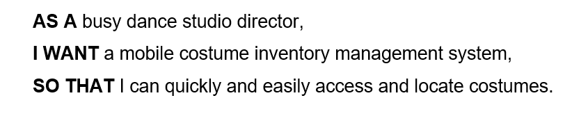

# Welcome to DESTINATION DANCE COSTUME INVENTORY app!

## Description

#### This DESTINATION DANCE COSTUME INVENTORY app has been created for a client that has requested an inventory management system that allows her to quickly and easily access and locate costumes for her busy dance studio. She can add, edit, and delete the inventory as needed.

## Table of Contents
* [Installation](#installation)
* [Usage](#usage)
* [Future Development](#future-developmet)
* [License](#license)
* [Demo & Deployment](#demo)
* [Contributors](#contributors)

## Installation
In order to install this repository, you will need to clone it and run npm init then npm install to install all of the dependencies listed inside the package.json file.

## Usage
To use this app after cloning and initializing the dependencies, run npm start in the terminal to start it in your local browser. This app has also been deployed through Heroku. See the Deployment section below for the link.

When the browser opens, you are greeted with the homepage.

New users need to be added to be able to use the inventory management app.

Returning users can login with their email and password.

Once logged in, you can choose the items that you would like to view and see the item name, description, location, size, and quantity.

This app allows the user to add, edit, and delete items as needed. 

This site is also mobile responsive!

## Future Development
We are currently working on the ability for the client to use QR Codes to track the bins the items are located in.

## License
The license for this project is the MIT.

Copyright © 2021

## Demo & Deployment
Watch this demo to see the DESTINATION DANCE COSTUME INVENTORY app in action!

https://watch.screencastify.com/<add link here>

This app is deployed on Heroku at: https://<add link here>.herokuapp.com/

### We hope you enjoy using this DESTINATION DANCE COSTUME INVENTORY app! We welcome all contributions and feedback!

## Contributors
*If you have any questions, please reach out to us at*

### _Paul Frueh_ 

Paul's Github: [@pfrueh1](https://github.com/pfrueh1/)

### _Robert Isaacs_ 

Robert's Github: [@kadargo63](https://github.com/Kardargo63)

### _Maria Sori_ 

Maria's Github: [@mariasori](https://github.com/mariasori)

### _Jamie Williams_ 

Jamie's GitHub: [@jamwil1226](https://github.com/jamwil1226/)

